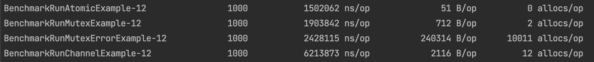
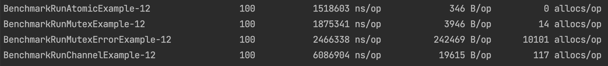

# Проверка на Benchmark скорость работы mutex, channel, atomic

Убедиться на примерах и бенчмарк к ним, что быстрее отработает при блокировке для счетчика.  
Проверяем:  
- sync.mutex
- channel
- atomic 

## Результат тестов(бенчмарк)
Бенчмарк показали, что быстрее всех отрабатывает пакет atomic, mutex, channel  
Можно смотреть на скрины. Тесты проводились со счетчиком равным 10000

`go test -bench=. -benchmem -benchtime=1000x`  
  

`go test -bench=. -benchmem -benchtime=100x`  

